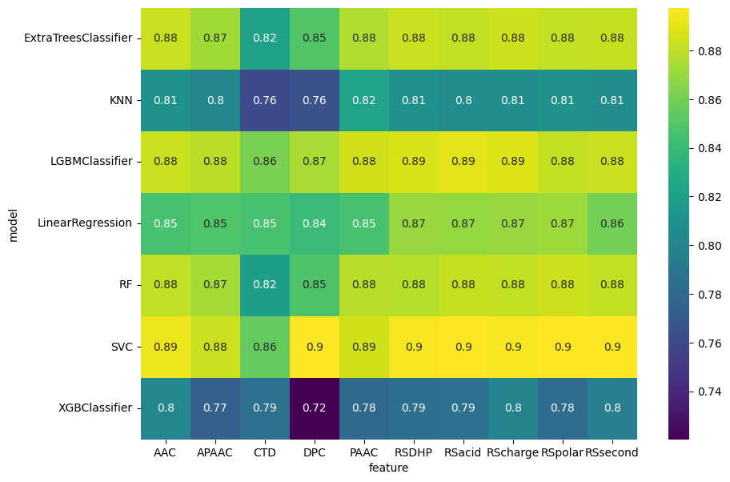
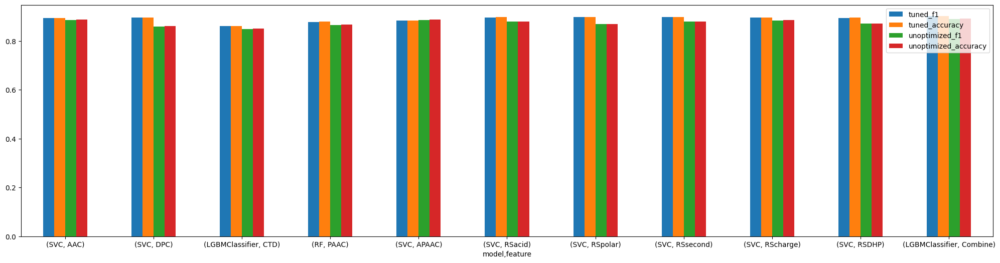

# Druggable Protien Prediction 

[Comprehensive Report](docs/Prediction_of_Durggable_Proteins_Report.pdf)

A Druggable Protein is a protein that can interact or attach with drug-like molecules and can result in
a desired state in medicinal treatments. Therefore, identifying druggable proteins is a huge asset in the
drug industry. But just plainly identifying them using traditional experiments is costly and
time-consuming. Therefore, it is proposed to determine different features of druggable proteins that
can help identify them and then, develop machine learning models using these features to predict the
druggability of a given protein sequence

# Dataset 
## Intro

The used dataset is in text format and can be located [here](dataset) we get positive and negative samples seperately

## Preprocessing

| Feature    | Description                                                          | Dimensions |
|------------|----------------------------------------------------------------------|------------|
| AAC        | Amino Acid Composition                                               | 20         |
| PAAC       | Pseudo Amino Acid Composition                                        | 21         |
| APAAC      | Amphiphilic Pseudo-Amino Acid Composition                            | 22         |
| CTD        | Composition, Transition, and Distribution                            | 273        |
| DPC        | Dipeptides Composition                                               | 400        |
| TPC        | Tripeptide Composition                                               | 8000       |
| GAAC       | any combination of three amino acids.                                | 5          |
| GDPC       | Grouped Dipeptide Composition                                        | 5          |
| RAAA       | Reduced Amino Acid Alphabet                                          | 5          |
| RSacid     | Charge, Aliphatic, Uncharged, and Negative Charged.                  | 32         |
| RScharge   | groups. This categorization not only decreased the complexity of     | 50         |
| RSDHP      | protein sequences but also facilitated the exploration of structural | 32         |
| RSpolar    | local regions and identified structural similarities.                | 32         |
| RSsecond   | Reduced amino acid Sequences according to secondary structure        | 40         |
| monoDiKGap | A variant of the Kmer feature extraction method                      | 16000      |

we extract encodings from protien sequences as denoted by [Charoenkwan et al](https://www.sciencedirect.com/science/article/pii/S2589004222011555) and create several feature encodings to test.
Each encoding and the several combinations are tested to ensure the best possible feature combination. 

# Models
## Base Classifier Results.

After the base classification choice an ensemble of models were made to improve the accuracy further.

## Hyperparameter Tuning.

An extensive hyperparameter tuning was conducted on the base classifiers to check their improvement.

